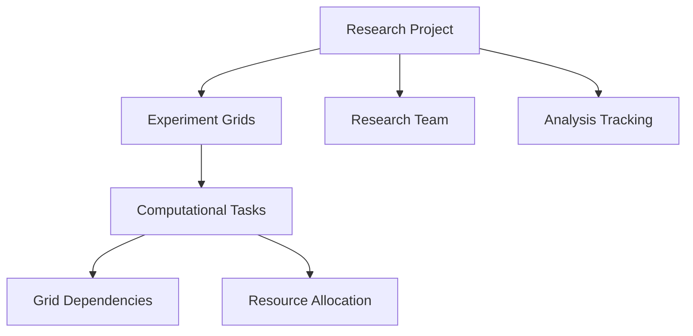

# Genetic Create Grid

A decentralized computational genetics research platform built on Stacks for collaborative grid-based genetic analysis and research.

## Overview

Genetic Create Grid empowers researchers to:
- Manage complex genetic research projects
- Track computational grid experiments
- Collaborate with fine-grained access controls
- Maintain immutable research records
- Coordinate distributed genetic analysis workflows

## Architecture

Genetic Create Grid uses a modular research management structure:



Core components:
- Research Projects: Top-level genetic research initiatives
- Experiment Grids: Computational research grid configurations
- Computational Tasks: Distributed genetic analysis tasks
- Research Team: Participants with specialized roles
- Analysis Tracking: Immutable research progression records

## Contract Documentation

### Main Contract: genetic-grid.clar

#### Status Constants
- `STATUS-PENDING` (1)
- `STATUS-IN-PROGRESS` (2)
- `STATUS-COMPLETED` (3)
- `STATUS-DELAYED` (4)
- `STATUS-CANCELLED` (5)

#### Role Constants
- `ROLE-ADMIN` (1)
- `ROLE-MEMBER` (2)
- `ROLE-VIEWER` (3)

## Getting Started

### Prerequisites
- Clarinet installed
- Stacks wallet for deployment/interaction

### Usage Examples

1. Create a new project:
```clarity
(contract-call? .pulse-forge create-project 
    "My Project" 
    "Project Description" 
    u1000)
```

2. Add team member:
```clarity
(contract-call? .pulse-forge add-team-member 
    u1 
    'ST1PQHQKV0RJXZFY1DGX8MNSNYVE3VGZJSRTPGZGM 
    u2)
```

3. Create milestone:
```clarity
(contract-call? .pulse-forge create-milestone 
    u1 
    "Phase 1" 
    "Initial phase" 
    u500)
```

## Function Reference

### Project Management

```clarity
(create-project (name (string-ascii 100)) (description (string-utf8 500)) (deadline uint))
(add-team-member (project-id uint) (member principal) (role uint))
(create-milestone (project-id uint) (name (string-ascii 100)) (description (string-utf8 500)) (deadline uint))
```

### Task Management

```clarity
(create-task (project-id uint) (milestone-id uint) (name (string-ascii 100)) (description (string-utf8 500)) (deadline uint) (dependencies (list 10 uint)))
(assign-task (project-id uint) (milestone-id uint) (task-id uint) (assignee principal))
(update-task-status (project-id uint) (milestone-id uint) (task-id uint) (new-status uint))
```

### Query Functions

```clarity
(get-project (project-id uint))
(get-milestone (project-id uint) (milestone-id uint))
(get-task (project-id uint) (milestone-id uint) (task-id uint))
(get-tasks-by-assignee (project-id uint) (assignee principal))
(get-upcoming-deadlines (project-id uint) (blocks-window uint))
```

## Development

### Testing
1. Clone the repository
2. Install dependencies: `clarinet install`
3. Run tests: `clarinet test`

### Local Development
1. Start local chain: `clarinet console`
2. Deploy contract
3. Interact using clarity console

## Security Considerations

1. Access Control
- Only authorized team members can perform actions
- Role-based permissions enforce access levels
- Admin privileges required for sensitive operations

2. Data Validation
- Deadline validation ensures future dates
- Status transitions are validated
- Dependencies are checked before task completion

3. Limitations
- Maximum 10 dependencies per task
- String length limits on names and descriptions
- List size constraints for scalability